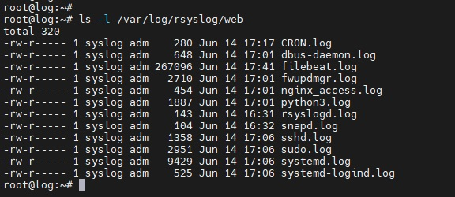
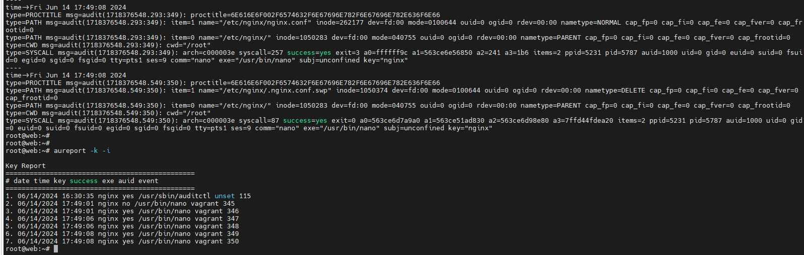
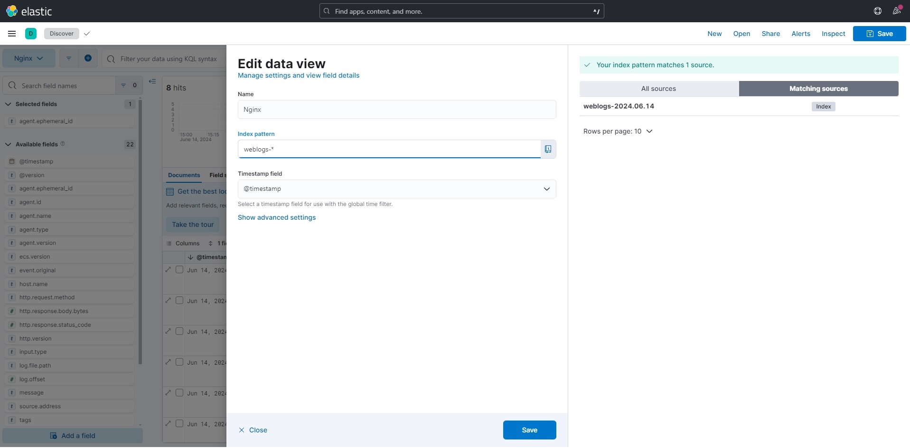
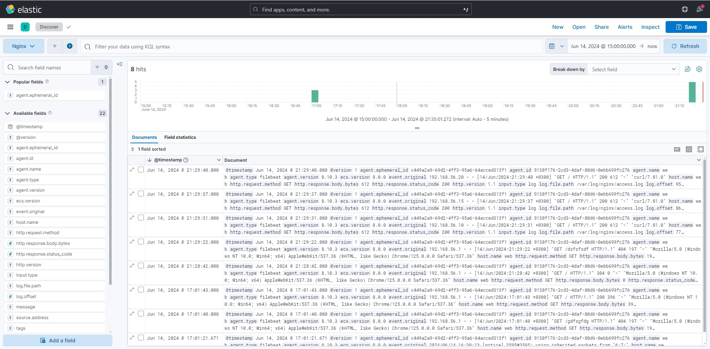
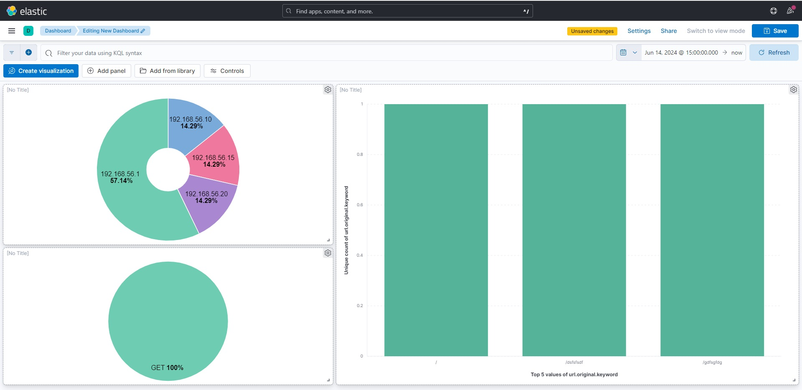

# Otus Homework 16. Сбор и анализ логов
### Цель домашнего задания
Научится проектировать централизованный сбор логов  
Рассмотреть особенности разных платформ для сбора логов
### Описание домашнего задания
1. В Vagrant разворачиваем 2 виртуальные машины web и log
2. На web настраиваем Nginx
3. На log настраиваем центральный лог сервер на любой системе на выбор
-	journald;
-	rsyslog;
-	ELK.
4. Настраиваем аудит, следящий за изменением конфигов Nginx 

**Дополнительное задание**
-	развернуть еще машину с elk
-	таким образом настроить 2 центральных лог системы ELK и какую либо еще;
- в ELK должны уходить только логи Nginx;
-	во вторую систему все остальное.

## Выполнение
Задание будет выполняться с помощью **Vagrant** и **Ansible**.  
В Vagrant разворачивает тестовый стенд:
* **web**
  - веб сервер  
  - **IP-адрес:** 192.168.56.10
* **log**
  - rsyslog server  
  - **IP-адрес:** 192.168.56.15
* **elk**
  - Elasticsearch, Logstash, Kibana  
  - **IP-адрес:** 192.168.56.15
 
На ВМ с установленным Ansible запускаем playbook:
```bash
ansible-playbook log.yml
```

### Настраиваем центральный лог сервер

На **log** настраиваем rsyslog сервер, чтобы он слушал на 514 порту и принимал логи в папку */var/log/rsyslog*:
##### /etc/rsyslog.conf
```bash
# provides UDP syslog reception
module(load="imudp")
input(type="imudp" port="514")

# provides TCP syslog reception
module(load="imtcp")
input(type="imtcp" port="514")
...
#Add remote logs
$template RemoteLogs,"/var/log/rsyslog/%HOSTNAME%/%PROGRAMNAME%.log"
*.* ?RemoteLogs
& ~
```
На **web** устанавливаем *nginx* и указываем в конфигурационном файле отправку логов на rsyslog сервер:
##### /etc/nginx/nginx.conf
```bash
 error_log  syslog:server=192.168.56.15:514,tag=nginx_error;
 access_log syslog:server=192.168.56.15:514,tag=nginx_access,severity=info combined;
```
Также в *rsyslog* клиенте настраиваем отправку всех логов на сервер:
##### /etc/rsyslog.d/all.conf
```bash
*.* @@192.168.56.15:514
```
В результате на сервере **log** в каталоге /var/log/rsyslog/web появятся логи с сервера **web**:  
  

### Настраиваем аудит, следящий за изменением конфигов Nginx
На **web** устанаваливаем утилиты *auditd* и *audispd-plugins*
Настраиваем audit на отслеживание изменений файлов в /etc/nginx:
##### /etc/audit/rules.d/nginx.rules
```bash
-w /etc/nginx/ -p w -k nginx
```

Теперь все изменения конфигурационных файлов Nginx будут отслеживаться с помощью auditd:  



### Развернуть ELK
На **elk** устанавливаем Elasticsearch, Logstash и Kibana из репозитория Яндекс. На **web** ставим Filebeat. Будем отправлять логи nginx на Logstash на сервере **elk**:
##### /etc/filebeat/filebeat.yml
```bash
filebeat.inputs:
- type: log
  paths:
    - /var/log/nginx/*.log
  enabled: true
  exclude_files: ['.gz$']
  prospector.scanner.exclude_files: ['.gz$']
filebeat.config.modules:
  path: ${path.config}/modules.d/*.yml
  reload.enabled: true
output.logstash:
  hosts: ["192.168.56.20:5044"]
```
Зайдем в Kibana по порту 5601. Мы увидим, что Logstash успешно получил логи Nginx от Filebeat и отправил их в Elasticsearch:  
  



На основании полученных логов можем построить простенький Dashboard:



